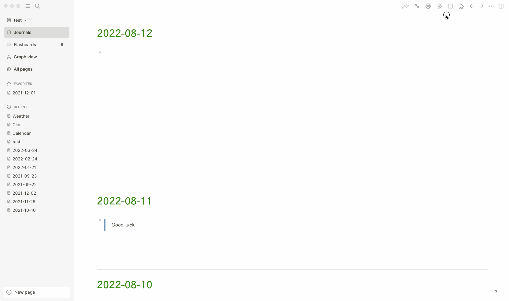

# Logseq Sidebar Preset

A Logseq plugin to provide a group of sidebar presets.

Logseq's sidebar is a dynamic region, sometimes you want to keep some pages or blocks always shown on top and in specific order. This plugin can help you achieve this.

It provides you five lists (I hope it's enough for you), you can choose to use one of them.

## Known issue

For now it can not clear those non-used panes, but you can use shortcut: double `cmd+c` to clear sidebar first, then click the reset sidebar toolbar icon.

## Buy me a coffee

If my plugin solve your situation a little bit and you will, you can choose to buy me a coffee via [this](https://www.buymeacoffee.com/vipzhicheng) and [this](https://afdian.net/@vipzhicheng).

## Licence
MIT
